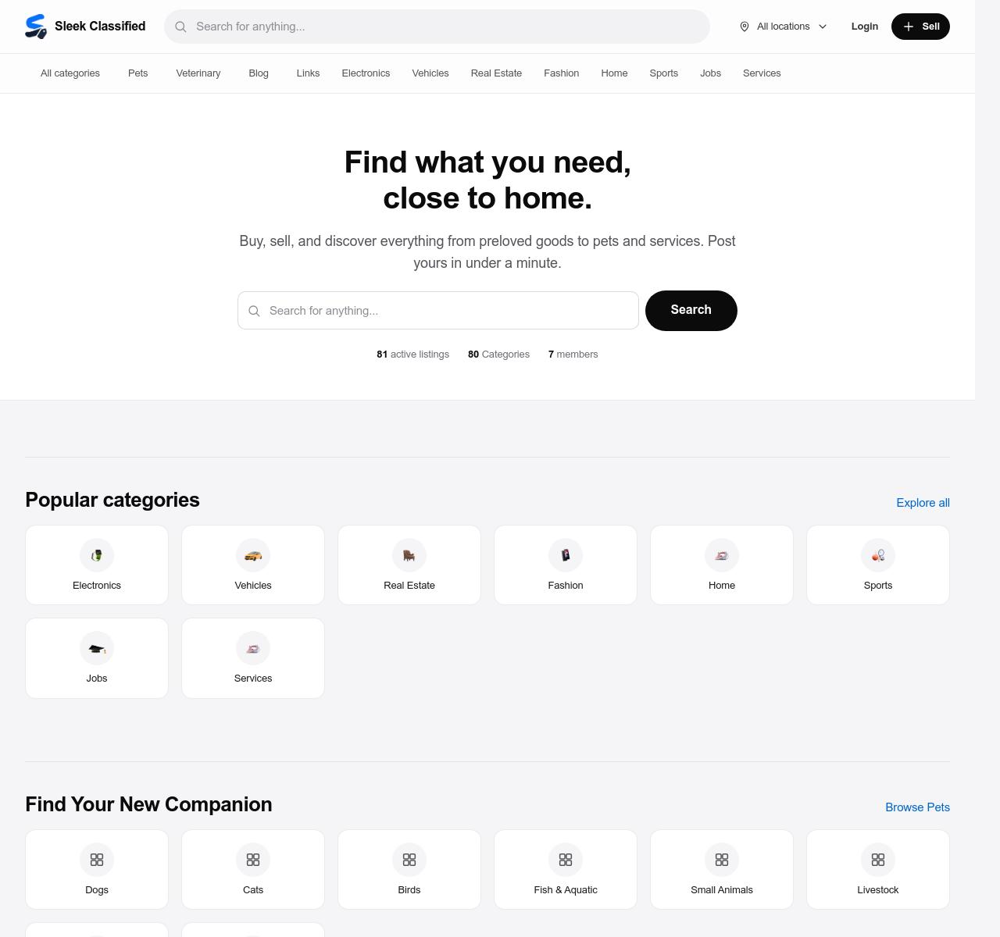

# SleekClassified

SleekClassified is a high-performance, modular classifieds marketplace platform built with Laravel 12, FilamentPHP v5, and a custom vanilla CSS design system.



## Features

- **Modular Monolith**: Encapsulated feature modules built with `nwidart/laravel-modules`.
- **Realtime Infrastructure**: Real-time messaging and notifications powered by Soketi and Laravel Reverb.
- **Multilingual Support**: Multi-language localization system (`en`, `hi`, `ta`, `tr`, `ar`, `zh`, `es`, `fr`, `de`, `pt`, `ru`, `ja`).
- **Comprehensive Verticals**: Support for general listings, pet adoption, veterinary clinic directories, blog articles, and rich link sharing.
- **Filament v5 Administration**: Full-featured administrative control panel.
- **Email Verification & SMTP**: Integrated email verification flow and transaction notification system.
- **Pure CSS & Strict TypeScript**: Modern, lightweight, framework-free browser front-end.

---

## Core Tech Stack

| Component | Technology |
|---|---|
| **Framework** | Laravel 12 |
| **Admin Panel** | Filament v5 |
| **Language** | PHP 8.4+ |
| **Database** | PostgreSQL 16+ with SoftDeletes |
| **Cache & Queue** | Redis |
| **Realtime WebSockets** | Soketi / Laravel Reverb + Laravel Echo |
| **Frontend Assets** | TypeScript, Vanilla CSS, Vite |

---

## Architecture & Code Standards

SleekClassified enforces strict architectural boundaries:

- **Modular Monolith**: Zero cross-module database JOINs. Modules interact strictly via support directory services (`App/Support`).
- **Strict Typing**: `declare(strict_types=1);` in every PHP file.
- **Self-Documenting Code**: Code is written clearly to avoid inline comments.
- **Fat Models & Thin Controllers**: Database access and business logic live inside Eloquent models.
- **Soft Deletes**: Soft delete traits enabled across all database models.

---

## Modules Directory

| Module | Purpose |
|---|---|
| `Site` | Layout templates, site branding, global search, localization |
| `Listing` | Classifieds listing creation, detail views, custom attributes |
| `Category` | Hierarchical category management |
| `Location` | Country, city, and district location management |
| `User` | Authentication, profile management, seller storefronts |
| `Panel` | Subscriber dashboard, ad management, account settings |
| `Conversation` | Real-time buyer-seller private chat inbox |
| `Favorite` | Saved listings, seller bookmarks, saved search alerts |
| `Offer` | Price negotiation and offer tracking |
| `Review` | Ratings, seller feedback, and trust scores |
| `Report` | Moderation queue and abuse report handling |
| `Notification` | System notifications and activity feeds |
| `Promotion` | Featured listing plans, billing, and promotions |
| `Page` | CMS content pages, legal terms, contact form |
| `Veterinary` | Veterinary hospital and pet clinic listings |
| `Pet` | Pet adoption and animal welfare listings |
| `Blog` | News articles, guides, and editorial content |
| `Linkit` | Rich link bookmarking with OpenGraph auto-fetching |
| `Admin` | Filament admin panel resources and configuration |
| `Theme` | Visual layout and theme resolution |

---

## Getting Started

### Prerequisites

- PHP 8.4+
- Composer 2+
- Node.js 20+
- PostgreSQL 16+
- Redis Server

---

### Local Installation

1. **Clone the repository**:
   ```bash
   git clone https://github.com/sleekclassified/sleekclassified.git
   cd sleekclassified
   ```

2. **Install PHP and Node dependencies**:
   ```bash
   composer install
   npm install
   ```

3. **Configure environment settings**:
   ```bash
   cp .env.example .env
   php artisan key:generate
   ```

4. **Run database migrations and seeders**:
   ```bash
   php artisan migrate --seed
   ```

5. **Build frontend assets**:
   ```bash
   npm run build
   ```

6. **Serve the application**:
   ```bash
   composer run dev
   ```

---

## Real-Time WebSockets Setup

### Option 1: Soketi (Pusher Protocol)

Update `.env`:

```env
BROADCAST_CONNECTION=pusher

PUSHER_APP_ID=local_app_id
PUSHER_APP_KEY=local_dev_key_7x39
PUSHER_APP_SECRET=local_dev_secret_9q42
PUSHER_HOST=socketi.sleekclassified.com
PUSHER_PORT=443
PUSHER_SCHEME=https

VITE_PUSHER_APP_KEY="${PUSHER_APP_KEY}"
VITE_PUSHER_HOST="socketi.sleekclassified.com"
VITE_PUSHER_PORT=443
VITE_PUSHER_SCHEME=https
```

### Option 2: Laravel Reverb

Update `.env`:

```env
BROADCAST_CONNECTION=reverb

REVERB_APP_ID=local_app_id
REVERB_APP_KEY=local_dev_key_7x39
REVERB_APP_SECRET=local_dev_secret_9q42
REVERB_HOST=localhost
REVERB_PORT=8080
REVERB_SCHEME=http

VITE_REVERB_APP_KEY="${REVERB_APP_KEY}"
VITE_REVERB_HOST="${REVERB_HOST}"
VITE_REVERB_PORT="${REVERB_PORT}"
VITE_REVERB_SCHEME="${REVERB_SCHEME}"
```

Start the Reverb server:

```bash
php artisan reverb:start
```

---

## Docker Deployment

Run with Docker Compose:

```bash
docker compose -f docker-compose.prod.yml up -d --build
```

Default URLs:
- **Web Interface**: `http://localhost:8000`
- **Admin Panel**: `http://localhost:8000/admin`
- **User Panel**: `http://localhost:8000/panel`

---

## Default Accounts

| Role | Email | Password | Access |
|---|---|---|---|
| **Administrator** | `a@a.com` | `236330` | Full Admin Panel & Platform Control |
| **Member User** | `b@b.com` | `36330` | Subscriber Dashboard & Marketplace Features |

---

## Quality Assurance & Tools

```bash
# Run PHPUnit Test Suite
php artisan test

# Format PHP Code with Laravel Pint
php vendor/bin/pint --format agent

# Type-check TypeScript & Build Frontend
npm run build
```

---

## Production Optimization Checklist

```bash
php artisan config:cache
php artisan route:cache
php artisan view:cache
php artisan event:cache
php artisan storage:link
```

---

## License

SleekClassified is open-source software licensed under the [MIT license](LICENSE).
